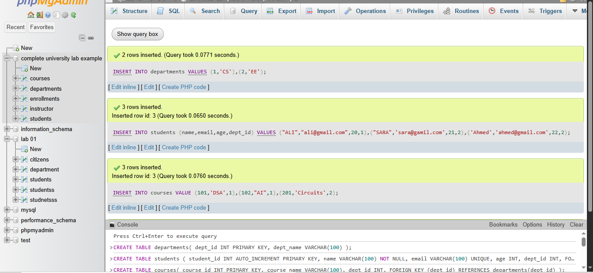
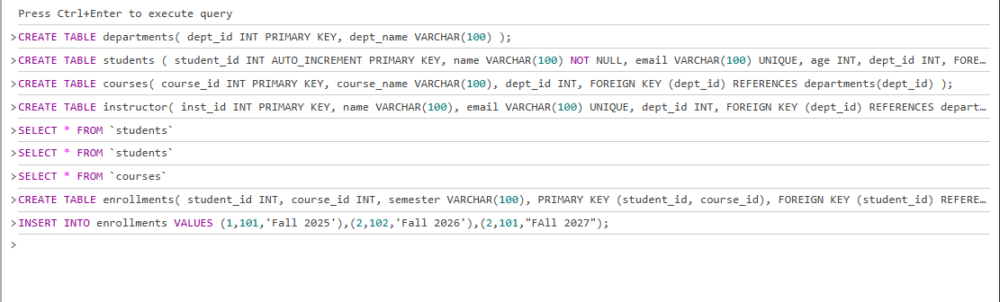
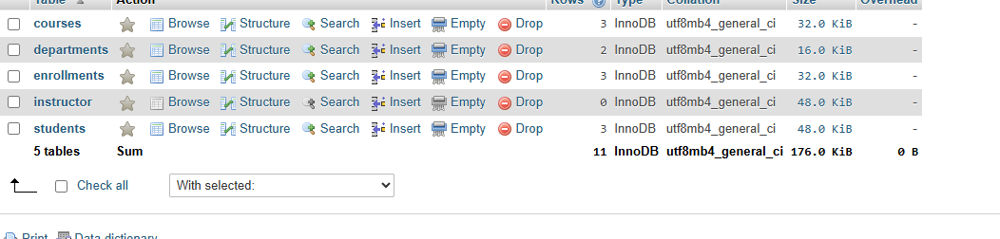
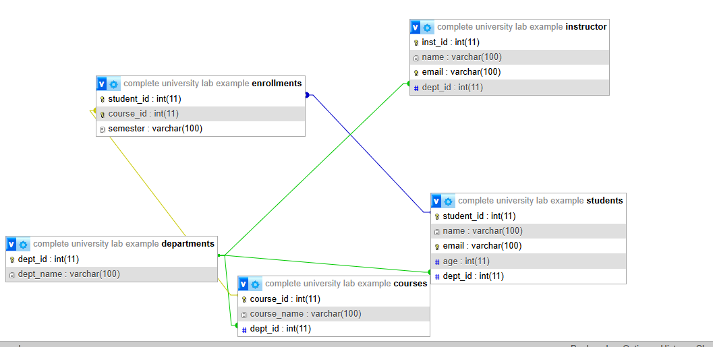

# University Lab Database Example

This repository contains a simple university lab database example designed for MySQL/phpMyAdmin. The schema includes departments, students, courses, instructors, and enrollments.

## Database Overview

The database is named `complete university lab example` and has the following tables:

- `departments`
- `students`
- `courses`
- `instructor`
- `enrollments`

The design represents a small university data model with department-based students, courses, and instructors, plus a many-to-many enrollment relationship between students and courses.

## Images

The repository includes the following image references with specific explanations:

- 
  - Shows the MySQL/phpMyAdmin SQL editor after running the `CREATE TABLE` and `INSERT` commands. It confirms successful insertion of sample department, student, course, and enrollment data.
- 
  - Shows the SQL query text in phpMyAdmin, including `CREATE TABLE` statements for `departments`, `students`, `courses`, `instructor`, and `enrollments`, followed by a sample `INSERT INTO enrollments` statement.
- 
  - Shows the database table list view in phpMyAdmin. This confirms the five tables exist and displays engine and collation details for `courses`, `departments`, `enrollments`, `instructor`, and `students`.
- 
  - Shows the entity-relationship diagram with foreign key connections: `departments` linked to `students`, `courses`, and `instructor`, and `students` linked to `courses` through `enrollments`.

These images can be viewed directly in GitHub or in a Markdown preview.

## Table Structure and Relationships

### `departments`
- `dept_id` INT PRIMARY KEY
- `dept_name` VARCHAR(100)

This table stores academic departments and is referenced by students, courses, and instructors.

### `students`
- `student_id` INT AUTO_INCREMENT PRIMARY KEY
- `name` VARCHAR(100) NOT NULL
- `email` VARCHAR(100) UNIQUE
- `age` INT
- `dept_id` INT FOREIGN KEY REFERENCES `departments`(`dept_id`)

Each student belongs to one department.

### `courses`
- `course_id` INT PRIMARY KEY
- `course_name` VARCHAR(100)
- `dept_id` INT FOREIGN KEY REFERENCES `departments`(`dept_id`)

Each course is offered by one department.

### `instructor`
- `inst_id` INT PRIMARY KEY
- `name` VARCHAR(100)
- `email` VARCHAR(100) UNIQUE
- `dept_id` INT FOREIGN KEY REFERENCES `departments`(`dept_id`)

Each instructor is assigned to one department.

### `enrollments`
- `student_id` INT FOREIGN KEY REFERENCES `students`(`student_id`)
- `course_id` INT FOREIGN KEY REFERENCES `courses`(`course_id`)
- `semester` VARCHAR(100)
- PRIMARY KEY (`student_id`, `course_id`)

This table implements a many-to-many relationship between students and courses, recording which student is enrolled in which course and in which semester.

## SQL Example

### Create tables

```sql
CREATE TABLE departments(
  dept_id INT PRIMARY KEY,
  dept_name VARCHAR(100)
);

CREATE TABLE students(
  student_id INT AUTO_INCREMENT PRIMARY KEY,
  name VARCHAR(100) NOT NULL,
  email VARCHAR(100) UNIQUE,
  age INT,
  dept_id INT,
  FOREIGN KEY (dept_id) REFERENCES departments(dept_id)
);

CREATE TABLE courses(
  course_id INT PRIMARY KEY,
  course_name VARCHAR(100),
  dept_id INT,
  FOREIGN KEY (dept_id) REFERENCES departments(dept_id)
);

CREATE TABLE instructor(
  inst_id INT PRIMARY KEY,
  name VARCHAR(100),
  email VARCHAR(100) UNIQUE,
  dept_id INT,
  FOREIGN KEY (dept_id) REFERENCES departments(dept_id)
);

CREATE TABLE enrollments(
  student_id INT,
  course_id INT,
  semester VARCHAR(100),
  PRIMARY KEY (student_id, course_id),
  FOREIGN KEY (student_id) REFERENCES students(student_id),
  FOREIGN KEY (course_id) REFERENCES courses(course_id)
);
```

### Insert example data

```sql
INSERT INTO departments VALUES (1, 'CS'), (2, 'EE');

INSERT INTO students(name, email, age, dept_id) VALUES
  ('ALI', 'ali@gmail.com', 20, 1),
  ('SARA', 'sara@gamil.com', 21, 2),
  ('Ahmed', 'ahmed@gmail.com', 22, 2);

INSERT INTO courses VALUES
  (101, 'DSA', 1),
  (102, 'AI', 1),
  (201, 'Circuits', 2);

INSERT INTO enrollments VALUES
  (1, 101, 'Fall 2025'),
  (2, 102, 'Fall 2026'),
  (2, 101, 'Fall 2027');
```

## Relationship Diagram

The schema follows these relationships:

- `departments` -> `students` : one department has many students
- `departments` -> `courses` : one department has many courses
- `departments` -> `instructor` : one department has many instructors
- `students` <-> `courses` : many-to-many through `enrollments`

This structure allows departments to organize both people and classes, while enrollments connect students and courses across semesters.

## Notes

- Use phpMyAdmin to run the SQL commands in the SQL query window.
- The sample data inserts demonstrate basic department, student, course, and enrollment records.
- The `email` fields in `students` and `instructor` are unique so duplicate addresses are prevented.

🗄️ Database & SQL Practice

A practical SQL reference and practice project covering Tables, Filtering, Joins, Aggregate Functions, and Scalar Functions.

📌 Overview

This project is designed to demonstrate the fundamental concepts of SQL and relational databases.

It covers:

🏗️ Creating database tables

🔍 Filtering data with WHERE

🔗 Combining tables with JOIN

📊 Using aggregate functions

🧮 Using scalar functions

📋 Writing clean and reusable SQL queries

🛠️ Topics Covered
Topic	Description
🏗️ CREATE TABLE	Creates a new database table
🔍 WHERE	Filters records based on conditions
🔗 JOIN	Combines data from multiple tables
📊 Aggregate Functions	Performs calculations on multiple rows
🧮 Scalar Functions	Performs operations on individual values
1. 🏗️ CREATE TABLE

CREATE TABLE is used to create a new table in a database.

Example
CREATE TABLE Employees (
    EmployeeID INT PRIMARY KEY,
    Name VARCHAR(100),
    Department VARCHAR(50),
    Salary DECIMAL(10, 2),
    HireDate DATE
);

📋 Example Structure
EmployeeID	Name	Department	Salary
1	Ali	IT	75000
2	Sara	HR	65000
3	Ahmed	Sales	55000
2. 🔍 FILTERING DATA

Filtering allows us to retrieve only the records that match a specific condition.

The most common filtering keyword is:

WHERE

Example
SELECT *
FROM Employees
WHERE Department = 'IT';

Multiple Conditions
SELECT *
FROM Employees
WHERE Salary > 60000
AND Department = 'IT';

Useful Filtering Operators
Operator	Meaning
=	Equal
<>	Not equal
>	Greater than
<	Less than
>=	Greater than or equal
<=	Less than or equal
AND	Both conditions must be true
OR	At least one condition must be true
IN	Matches any value in a list
BETWEEN	Checks a range
LIKE	Pattern matching
Example with LIKE
SELECT *
FROM Employees
WHERE Name LIKE 'A%';


This returns employees whose names start with A.

3. 🔗 JOIN

A JOIN is used to combine records from two or more related tables.

Example Tables
Employees
EmployeeID | Name   | DepartmentID
-----------|--------|-------------
1          | Ali    | 10
2          | Sara   | 20
3          | Ahmed  | 10

Departments
DepartmentID | DepartmentName
-------------|---------------
10           | IT
20           | HR

🔵 INNER JOIN

Returns records that have matching values in both tables.

SELECT
    Employees.Name,
    Departments.DepartmentName
FROM Employees
INNER JOIN Departments
    ON Employees.DepartmentID = Departments.DepartmentID;

🟢 LEFT JOIN

Returns all records from the left table and matching records from the right table.

SELECT
    Employees.Name,
    Departments.DepartmentName
FROM Employees
LEFT JOIN Departments
    ON Employees.DepartmentID = Departments.DepartmentID;

🟡 RIGHT JOIN

Returns all records from the right table and matching records from the left table.

SELECT
    Employees.Name,
    Departments.DepartmentName
FROM Employees
RIGHT JOIN Departments
    ON Employees.DepartmentID = Departments.DepartmentID;

4. 📊 AGGREGATE FUNCTIONS

Aggregate functions perform calculations on multiple rows and return a single result.

Common Aggregate Functions
Function	Purpose
COUNT()	Counts rows
SUM()	Adds values
AVG()	Calculates average
MIN()	Finds minimum value
MAX()	Finds maximum value
🔢 COUNT()
SELECT COUNT(*) AS TotalEmployees
FROM Employees;

➕ SUM()
SELECT SUM(Salary) AS TotalSalary
FROM Employees;

📈 AVG()
SELECT AVG(Salary) AS AverageSalary
FROM Employees;

⬇️ MIN()
SELECT MIN(Salary) AS LowestSalary
FROM Employees;

⬆️ MAX()
SELECT MAX(Salary) AS HighestSalary
FROM Employees;

📦 GROUP BY

GROUP BY is commonly used with aggregate functions to calculate results for each group.

SELECT
    Department,
    AVG(Salary) AS AverageSalary
FROM Employees
GROUP BY Department;

Example Result
Department	AverageSalary
IT	72500
HR	65000
Sales	55000
5. 🧮 SCALAR FUNCTIONS

Scalar functions operate on one value at a time and return a single value for each row.

Common scalar functions include:

🔤 String functions

🔢 Numeric functions

📅 Date functions

🔄 Conversion functions

🔤 String Functions
UPPER()

Converts text to uppercase.

SELECT UPPER(Name) AS EmployeeName
FROM Employees;

LOWER()

Converts text to lowercase.

SELECT LOWER(Name) AS EmployeeName
FROM Employees;

LENGTH()

Returns the number of characters.

SELECT
    Name,
    LENGTH(Name) AS NameLength
FROM Employees;


Function names can vary between database systems. For example, SQL Server commonly uses LEN() instead of LENGTH().

🔢 Numeric Functions
ROUND()

Rounds a number to a specified number of decimal places.

SELECT ROUND(AVG(Salary), 2) AS AverageSalary
FROM Employees;

6. 📅 DATE FUNCTIONS

Date functions allow us to work with date and time values.

Example
SELECT
    Name,
    HireDate
FROM Employees
WHERE HireDate >= '2025-01-01';


Depending on the database system, functions such as YEAR(), MONTH(), and DAY() may be available.

SELECT
    Name,
    YEAR(HireDate) AS HireYear
FROM Employees;

7. 🚀 COMBINING EVERYTHING

SQL becomes powerful when these concepts are combined.

Example
SELECT
    d.DepartmentName,
    COUNT(e.EmployeeID) AS TotalEmployees,
    AVG(e.Salary) AS AverageSalary,
    MAX(e.Salary) AS HighestSalary
FROM Employees e
INNER JOIN Departments d
    ON e.DepartmentID = d.DepartmentID
WHERE e.Salary > 50000
GROUP BY d.DepartmentName;


This query:

🔗 Joins employees with departments

🔍 Filters employees earning more than 50,000

📊 Counts employees

📈 Calculates the average salary

⬆️ Finds the highest salary

📦 Groups the results by department

📚 SQL Cheat Sheet
CREATE TABLE  → Create a table
SELECT        → Retrieve data
WHERE         → Filter data
JOIN          → Combine tables
GROUP BY      → Group rows
COUNT()       → Count rows
SUM()         → Add values
AVG()         → Calculate average
MIN()         → Find minimum
MAX()         → Find maximum
UPPER()       → Convert text to uppercase
LOWER()       → Convert text to lowercase
ROUND()       → Round numbers

🎯 Learning Goals

By completing this project, you should be able to:

✅ Create relational database tables

✅ Retrieve and filter records

✅ Combine multiple tables using joins

✅ Calculate statistics using aggregate functions

✅ Manipulate individual values using scalar functions

✅ Combine multiple SQL concepts in a single query

✅ Write cleaner and more readable SQL

📁 Suggested Project Structure
database-sql-practice/
│
├── README.md
│
├── sql/
│   ├── create_tables.sql
│   ├── filtering.sql
│   ├── joins.sql
│   ├── aggregate_functions.sql
│   └── scalar_functions.sql
│
└── data/
    └── sample_data.sql

💡 Practice Challenge

Try writing a query that:

Finds each department's total number of employees, average salary, minimum salary, and maximum salary, but only includes employees earning more than 50,000.

⭐ Bonus

Add a filter so that only departments with an average salary greater than 60,000 are displayed.

🧠 Key Idea

SQL is about turning data into useful information.

Start with:

CREATE TABLE → build your data

⬇️

WHERE → filter your data

⬇️

JOIN → connect your data

⬇️

GROUP BY + Aggregate Functions → summarize your data

⬇️

Scalar Functions → transform individual values

📜 License

This project is intended for learning and educational purposes.

⭐ If you find this project useful, consider giving it a star!


